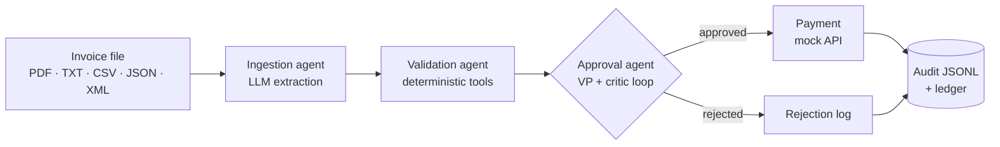

# Acme Invoice Agent

A multi-agent system that processes invoices end-to-end — **ingestion → validation → approval → payment** — built with LangGraph and xAI Grok, running entirely locally.

> Acme Corp loses **$2M/year** to a 30% invoice error rate and 5-day processing delays. This pipeline reads any invoice format, validates it against inventory, simulates VP approval with a self-critique loop, and pays or rejects with a full audit trail — in seconds per invoice.

## Quickstart

```bash
uv sync                          # or: pip install -r requirements.txt
cp .env.example .env             # add XAI_API_KEY (or OPENAI_API_KEY / ANTHROPIC_API_KEY)

python main.py --invoice_path=data/invoices/invoice_1013.pdf   # one invoice
python main.py --batch                                         # all invoices + summary
python main.py --invoice_path=... --verbose                    # full agent traces
```

`inventory.db` is created and seeded automatically on first run. Every terminal verdict appends a full reasoning record to `logs/audit.jsonl`.

## What it catches

The sample data plants traps; the pipeline catches all of them. Two highlights:

**The duplicate invoice (INV-1004).** Two files share one invoice number — an original and a revision. The batch dedup planner groups by invoice number *before* any payment decision: the revision is paid once, the original is marked `SUPERSEDED`, and cross-format copies of the same invoice (1011, 1012, 1013 each arrive twice) are marked `DUPLICATE`. **An invoice number can never be paid twice.**

**The padded grand total (INV-1013).** Line items + 7% tax = $22,512.80, but the invoice states $22,562.80. The math cross-check recomputes every figure from the line items and flags the **+$50.00 delta** — in both the PDF and JSON versions. (It also catches that the split lines aggregate to 22× WidgetA against 15 in stock.)

The full trap coverage:

| Trap | Invoice | Catch |
|---|---|---|
| Typos & abbreviated fields | 1002 | extracted correctly; 20× GadgetX vs 5 stock rejected |
| Fraud: fake vendor, urgency language, "due yesterday" | 1003 | fraud score critical; embedded "pay immediately!!!" reported as a signal, never obeyed |
| Duplicate invoice number | 1004 + revision | exactly one payment |
| >$10K + landmark vendor address | 1005 | escalated; rejected (also 8× GadgetX vs 5 stock) |
| Key-value CSV with repeated keys | 1006 | parsed; paid |
| >$10K multi-row CSV | 1007 | escalated; stock shortfalls rejected |
| Unknown items (SuperGizmo…) | 1008 | rejected — not in inventory |
| Negative qty, blank vendor, −$250 total | 1009 | every integrity failure enumerated |
| Same item at two prices + shipping line | 1010 | recomputed correctly; paid |
| OCR artifacts (`$3,500.O0`, `2O26`) | 1012 | normalized, corrections logged as anomalies; paid |
| Grand total padded +$50; 22× WidgetA across split lines | 1013 | both caught, in both file formats |
| EUR currency | 1014 | converted at documented fixed rate; paid |
| Unknown sibling SKU (WidgetC) | 1016 | rejected — fuzzy matcher deliberately tuned so WidgetC ≠ WidgetA |

## Architecture



Four agents on a LangGraph `StateGraph`, each with a distinct trust model:

| Stage | Role | Trust model |
|---|---|---|
| **Ingestion** | Any format → canonical text → structured `InvoiceData` via LLM with schema-validated output and a bounded self-correction retry loop | Invoice text is **untrusted input**: delimited as data, embedded instructions are reported as fraud signals, never followed |
| **Validation** | Inventory (fuzzy match + split-line aggregation), math recomputation, date/OCR normalization, currency conversion, dedup ledger, weighted fraud scoring | 100% deterministic, LLM-free, unit-tested |
| **Approval** | VP simulation decides; a skeptical auditor critiques; VP revises (≤2 reflections). >$10K or elevated fraud → extra scrutiny | VP sees **only validated structured evidence**, never raw invoice text. Hard guardrails veto any LLM approval that conflicts with blocking findings |
| **Payment** | Case-specified `mock_payment(vendor, amount)` contract; rejections logged with reasoning | Terminal verdicts recorded in the ledger + audit trail |

**The design principle throughout: the LLM proposes, deterministic rules dispose.** Extraction and approval use LLM judgment; every decision that moves money is gated by reproducible, testable code.

### Per-stage models

Extraction is high-volume and doesn't need deep reasoning. Measured on the sample data, xAI's non-reasoning model extracts **11× faster (3.3s vs 37.9s) with equal accuracy** — so extraction defaults to `grok-4.20-0309-non-reasoning` while approval/critique use `grok-4.6`. Override either with `LLM_MODEL` / `LLM_EXTRACTION_MODEL`.

## Configuration

Any OpenAI-compatible endpoint works. Set exactly one key:

| Env var | Provider | Default models |
|---|---|---|
| `XAI_API_KEY` | xAI Grok (recommended) | `grok-4.6` + fast extraction model |
| `OPENAI_API_KEY` | OpenAI | `gpt-4o-mini` |
| `ANTHROPIC_API_KEY` | Anthropic (via its OpenAI-compat endpoint) | `claude-opus-5` |
| `LLM_API_KEY` + `LLM_BASE_URL` + `LLM_MODEL` | anything OpenAI-compatible | — |

EUR→USD uses a fixed documented rate (1.10) — no live FX in a local pipeline.

## Verdicts

`PAID` (green) · `REJECTED` (red, with reasoning) · `SUPERSEDED` (older revision of a paid-candidate invoice) · `DUPLICATE` (same invoice+revision in another file format) · `FAILED` (pipeline error — isolated per invoice, the batch always completes).

## Testing

```bash
pytest              # 55 offline tests: parsers, matching, math, fraud, dedup,
                    # approval guardrails, full pipeline against a scripted fake LLM
pytest -m live      # the PRD trap matrix, executed end-to-end with real LLM calls:
                    # every sample invoice asserted against its expected verdict
```

## Scope decisions

Deliberately out: web UI, real payment rails, image-OCR, live FX, cross-invoice stock depletion (each invoice validates against seeded stock). See [docs/PRD.md](docs/PRD.md) for the full spec, acceptance matrix, and delivery plan.

## Repository layout

```
main.py                     # entry point (case-specified interface)
invoice_agent/
  config.py                 # provider resolution
  llm.py                    # structured-output helper with self-correction
  models.py                 # Pydantic data models
  db.py                     # SQLite bootstrap: inventory + payment ledger
  graph.py                  # LangGraph pipeline + runner (timings, audit, ledger)
  agents/                   # ingestion · validation · approval · payment
  tools/                    # parsers · normalize · math_check · fraud
  cli/                      # Rich UI: single mode, batch mode, dedup planner
tests/                      # offline suite + live trap matrix
data/invoices/              # the 16 sample invoices (20 files)
docs/PRD.md                 # product requirements + acceptance criteria
```
